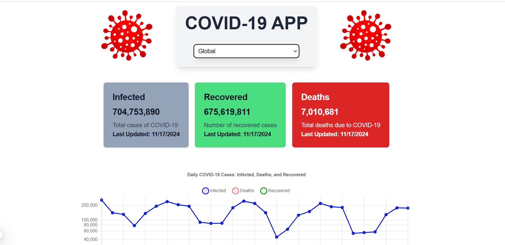
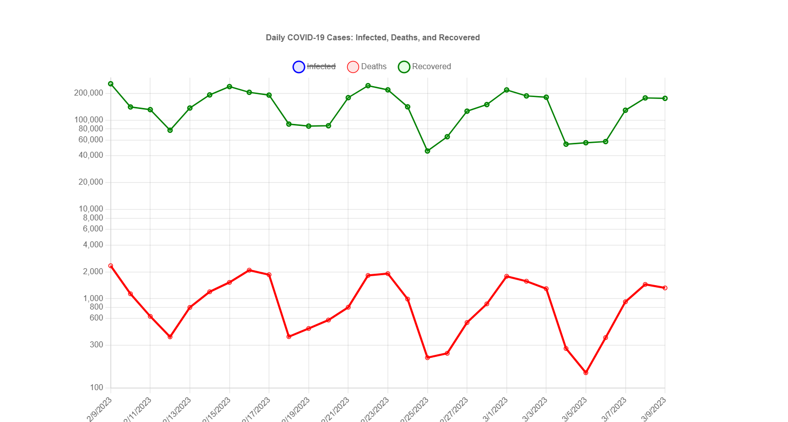
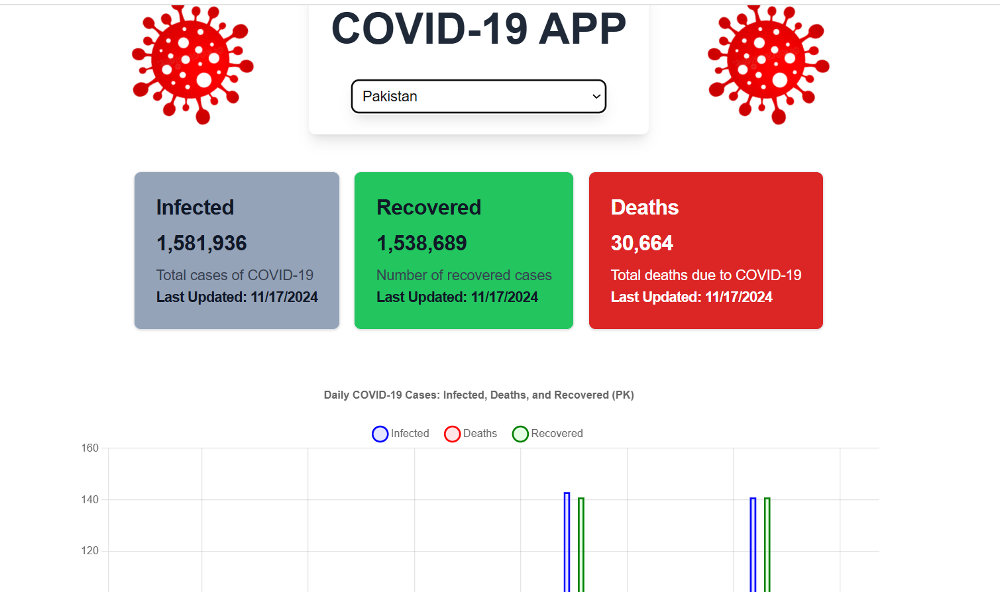

Here’s an updated and more polished version of your `README.md` file to make it even more engaging and professional:

---

# COVID-19 Tracker App

The **COVID-19 Tracker App** is a powerful web application that provides real-time insights into the global and country-specific impact of the COVID-19 pandemic. Featuring interactive visualizations, historical data, and responsive design, this app is your go-to tool for understanding pandemic trends in a clear and concise manner.

---

## Features at a Glance

- 🌎 **Global and Country-specific Statistics**  
  - Stay informed with worldwide and localized COVID-19 data, including cases, recoveries, and deaths.

- 🔄 **Real-time Data Updates**  
  - Leveraging live APIs for the latest statistics, ensuring the information is always accurate.

- 📊 **Interactive Charts**  
  - Line charts for global trends and bar charts for country-specific insights.  
  - Hover over data points to reveal daily statistics.

- 🔍 **Search and Filter Options**  
  - Quickly switch between countries using a dropdown menu with real-time search capabilities.

- 📅 **Historical Data Analysis**  
  - Explore how COVID-19 trends have evolved over time.

- 📱 **Responsive Design**  
  - Fully optimized for use on all devices, from mobile phones to large screens.

---

## Live APIs Used

### Global and Country-specific Data
- **Endpoint**: [`https://disease.sh/v3/covid-19/all`](https://disease.sh/v3/covid-19/all)  
- **Description**: Fetch global COVID-19 statistics including total cases, recoveries, deaths, and daily updates.  

#### Country-specific Data:  
- Use [`https://disease.sh/v3/covid-19/countries/{country}`](https://disease.sh/docs/#/COVID-19%3A%20Countries/get_v3_covid_19_countries__country_) by replacing `{country}` with an ISO2 code (e.g., `US`, `IN`, etc.).

### Historical Data
- **Endpoint**: [`https://disease.sh/v3/covid-19/historical/all`](https://disease.sh/v3/covid-19/historical/all)  
- **Description**: Access historical global data for cases, recoveries, and deaths to track daily differences.

---

## Installation & Setup

Follow these steps to set up the application locally:

### Step 1: Clone the Repository
```bash
git clone https://github.com/your-repo/covid-19-tracker.git
cd covid-19-tracker
```

### Step 2: Install Dependencies
```bash
npm install
```

### Step 3: Start the Development Server
```bash
npm run dev
```

The app will be accessible at [http://localhost:3000](http://localhost:3000).

---

## How to Use

1. **View Global Statistics**  
   - By default, the app displays worldwide statistics and trends using an interactive line chart.

2. **Country-specific Insights**  
   - Select a country from the dropdown menu to view detailed statistics and trends in a bar chart.

3. **Hover for Details**  
   - Hover over data points on the charts to see exact figures for each day.

4. **Explore Historical Data**  
   - Dive into the historical timeline to analyze how cases, recoveries, and deaths have evolved over time.

---

## Built With

- **Frontend**: React, Next.js, TypeScript  
- **Styling**: Tailwind CSS  
- **Charts**: Chart.js  
- **Data Fetching**: Axios  
- **APIs**: [Disease.sh COVID-19 API](https://disease.sh/docs/)

---


## Screenshots

### 1. Home Page  


### 2. Global Statistics Chart  


### 3. Country Dropdown and Bar Chart  


- Global statistics chart  
- Country dropdown selection  
- Bar chart with country-specific insights  

---

## Deployment

### Deploy on Vercel  
The easiest way to deploy your Next.js app is through [Vercel](https://vercel.com).  

### Steps:  
1. Sign in to [Vercel](https://vercel.com).  
2. Link your GitHub repository.  
3. Follow the guided deployment process.  

For more details, see the official [Next.js Deployment Documentation](https://nextjs.org/docs/app/building-your-application/deploying).

---

## Learn More about Next.js

- **[Next.js Documentation](https://nextjs.org/docs)**: Explore Next.js features and API references.  
- **[Interactive Tutorials](https://nextjs.org/learn)**: Hands-on learning with step-by-step examples.  
- **[GitHub Repository](https://github.com/vercel/next.js)**: Contribute to the Next.js community.

---

## License

This project is licensed under the **MIT License**. Feel free to use, modify, and distribute it as per the terms of the license.

---

## Contributing

Contributions are welcome!  
1. Fork the repository.  
2. Create a new branch for your feature (`git checkout -b feature-name`).  
3. Commit your changes (`git commit -m 'Add feature'`).  
4. Push to the branch (`git push origin feature-name`).  
5. Open a pull request.

---

This polished `README.md` is now more engaging, with clear sections and formatting, and provides all the necessary information to attract contributors and guide users.